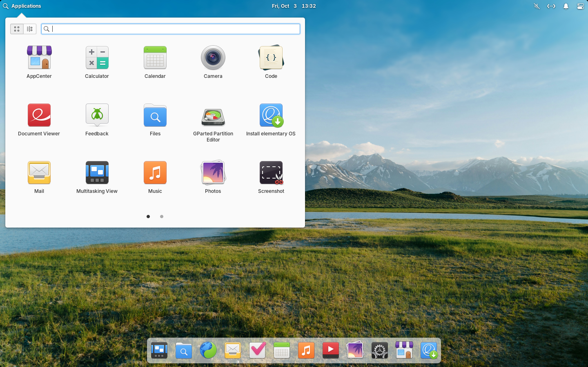
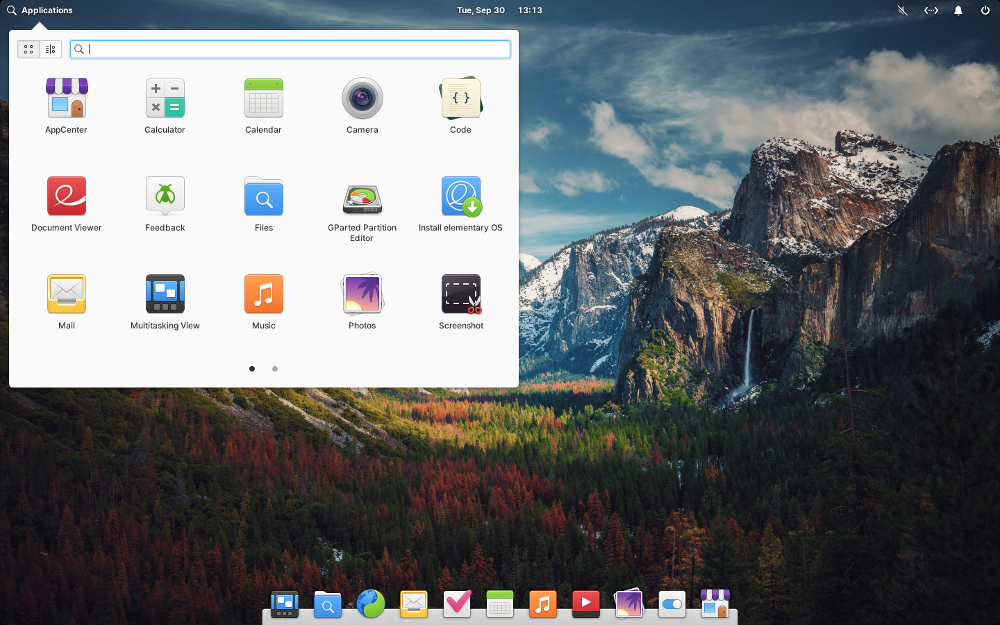
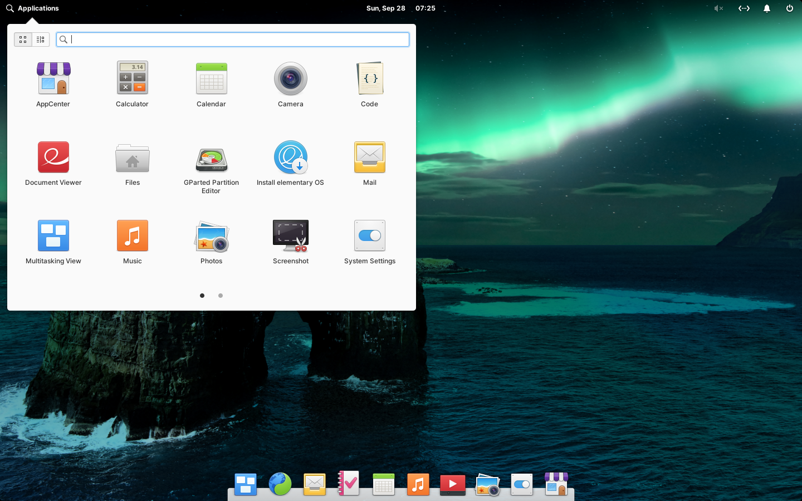
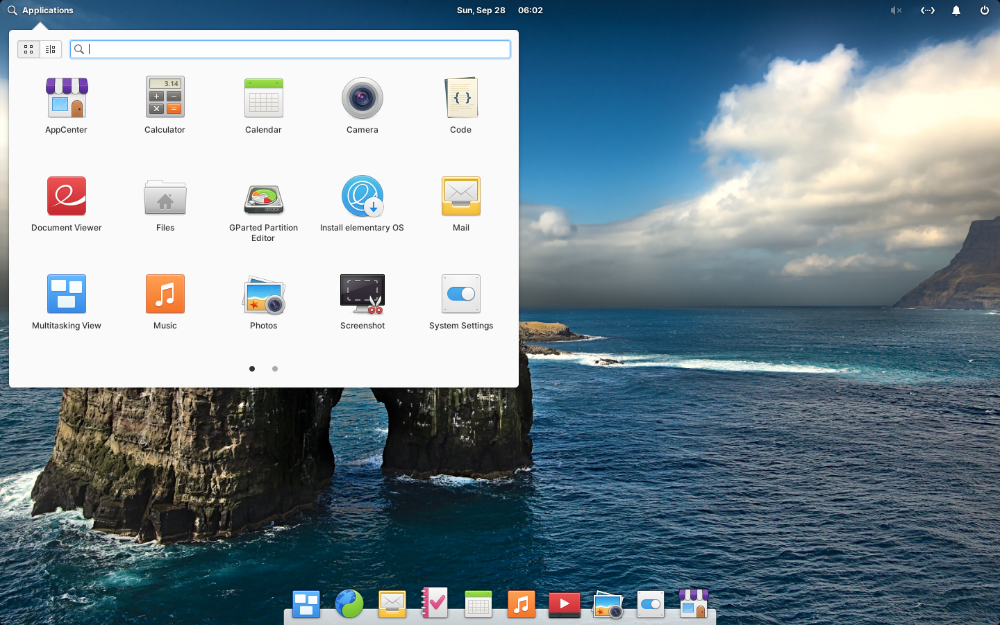
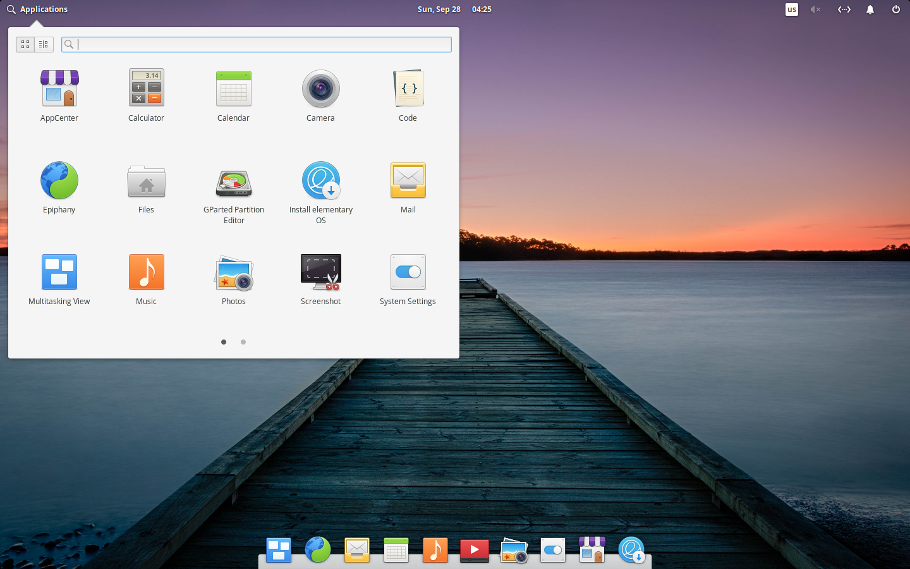
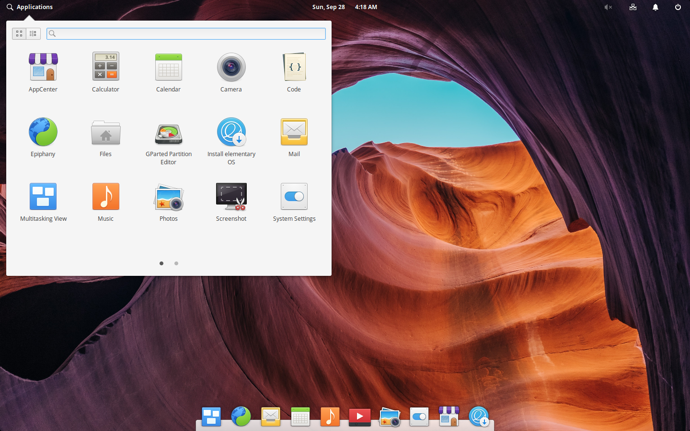
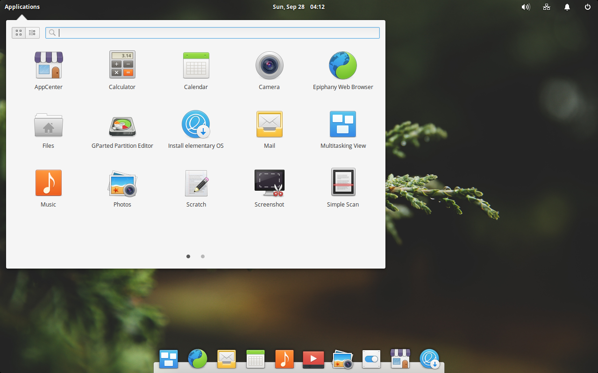
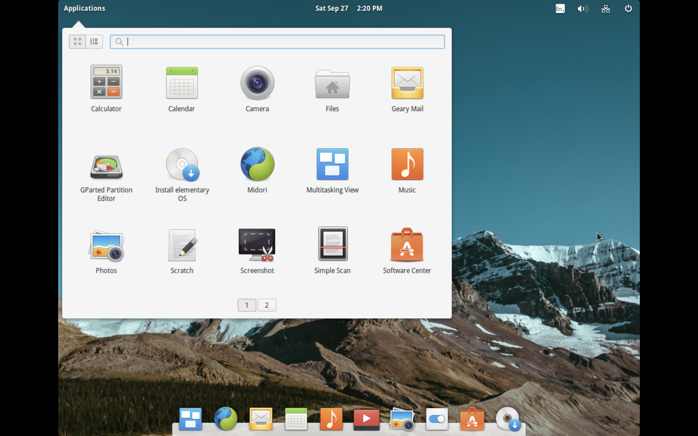
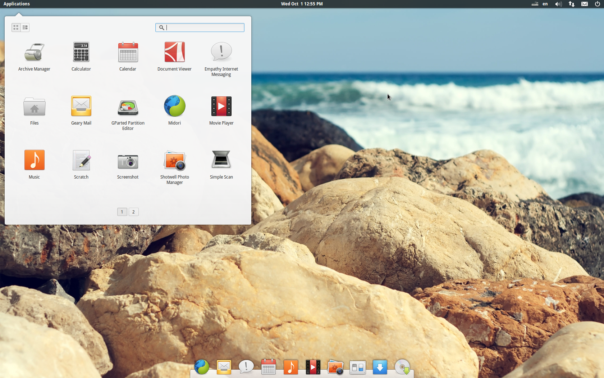
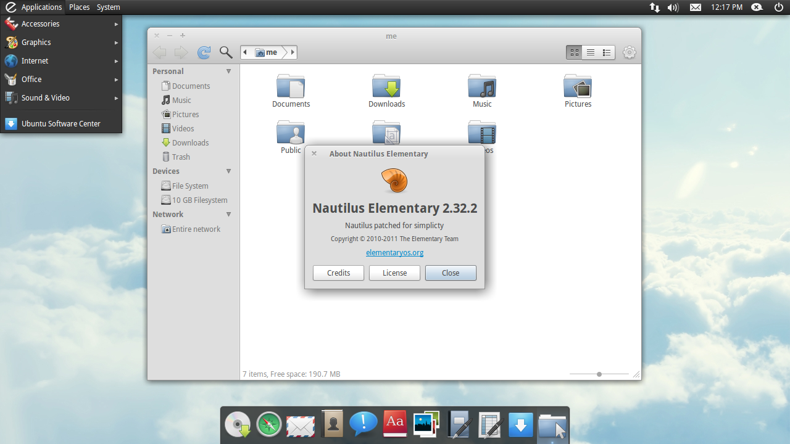

# Wallpapers History
History of the default wallpapers in elementary OS.

> [!WARNING]
> The default wallpapers on ancient OS releases originally from DeviantArt have been removed from recent OS releases due to licensing problem. Use them in personal use.

## OS 8 Circe

[Download Wallpaper](https://github.com/elementary/wallpapers/blob/8.0.0/backgrounds/A%20Large%20Body%20of%20Water%20Surrounded%20By%20Mountains.jpg)

- Author: [Peter Thomas](https://unsplash.com/photos/a-large-body-of-water-surrounded-by-mountains-Dxod5pdRtsk)
- Shipped versions
    - OS 8 (default)

## OS 7/7.1 Horus

[Download Wallpaper](https://github.com/elementary/wallpapers/blob/8.0.0/backgrounds/Photo%20of%20Valley.jpg)

- Author: [Aniket Deole](https://unsplash.com/photos/photo-of-valley-M6XC789HLe8)
- Shipped versions
    - OS 8
    - OS 7.1 (default)
    - OS 7 (default)

## OS 6.1 Jólnir

[Download Wallpaper](https://github.com/elementary/wallpapers/blob/8.0.0/backgrounds/odin-dark.jpg)

- Author: Brendon Porter, Ryan Gorley, et al.
- Shipped versions
    - OS 8
    - OS 7.1
    - OS 7
    - OS 6.1 (default)
    - OS 6

## OS 6 Odin

[Download Wallpaper](https://github.com/elementary/wallpapers/blob/8.0.0/backgrounds/odin.jpg)

- Author: Brendon Porter, Ryan Gorley, et al.
- Shipped versions
    - OS 8
    - OS 7.1
    - OS 7
    - OS 6.1
    - OS 6 (default)

## OS 5.1 Hera

[Download Wallpaper](https://github.com/elementary/wallpapers/blob/8.0.0/backgrounds/Sunset%20by%20the%20Pier.jpg)

- Author: [Paul Carmona](https://unsplash.com/photos/empty-bridge-along-body-of-water-ces8_Bo7bhQ)
- Shipped versions
    - OS 8
    - OS 7.1
    - OS 7
    - OS 6.1
    - OS 6
    - OS 5.1 (default)
    - OS 5

## OS 5 Juno

[Download Wallpaper](https://github.com/elementary/wallpapers/blob/8.0.0/backgrounds/Ashim%20DSilva.jpg)

- Author: [Ashim D’Silva](https://unsplash.com/photos/scenery-of-mountain-canyon-WeYamle9fDM)
- Shipped versions
    - OS 8
    - OS 7.1
    - OS 7
    - OS 6.1
    - OS 6
    - OS 5.1
    - OS 5 (default)

## OS 0.4/0.4.1 Loki

[Download Wallpaper](https://github.com/elementary/wallpapers/blob/58f43b8083c6384e15b4625febb5ab5c78f1bd3f/backgrounds/Pablo%20Garcia%20Saldana.jpg)

- Author: [Pablo García Saldaña](https://unsplash.com/photos/tilt-shift-lens-photography-of-pine-tree-twig-15d_4S2tJsQ)
- Shipped versions
    - OS 5.1
    - OS 5
    - OS 0.4/0.4.1 (default)
- Reason of removal
    - [Does not have a transparent panel](https://github.com/elementary/wallpapers/pull/96)

## OS 0.3/0.3.1/0.3.2 Freya

[Download Wallpaper](https://github.com/elementary/wallpapers/blob/d35939109fb60ea1aaf56f85738834077d0bbd58/backgrounds/Ryan%20Schroeder.jpg)

- Author: [Ryan Schroeder](https://unsplash.com/photos/landscape-photography-mountain-range-with-snow-Gg7uKdHFb_c)
- Shipped versions
    - OS 5.1
    - OS 5
    - OS 0.4/0.4.1
    - OS 0.3/0.3.1/0.3.2 (default)
- Reason of removal
    - [In favor of `Snow-Capped Mountain.jpg`](https://github.com/elementary/wallpapers/pull/101#issuecomment-614933440)

## OS 0.2 Luna

[Download Wallpaper](https://github.com/elementary/wallpapers/blob/bdbed827257acb23eb2587e9d0cb191dda41a063/94.jpg)

- Author: [bo0xvn](http://bo0xvn.deviantart.com/art/94-206184488)
- Shipped versions
    - OS 0.4/0.4.1
    - OS 0.3/0.3.1/0.3.2
    - OS 0.2 (default)
- Reason of removal
    - [Licensing](https://github.com/elementary/wallpapers/pull/18)

## OS 0.1 Jupiter

[Download Wallpaper](https://github.com/elementary/wallpapers/blob/e53e42e45973b406c4b82fe4c4d2682f302bc010/extra/16.jpg)

- Author: [bo0xvn](https://www.deviantart.com/bo0xvn/art/16-195628281)
- Shipped versions
    - OS 0.3/0.3.1/0.3.2
    - OS 0.2
    - OS 0.1 (default)
- Reason of removal
    - [Licensing](https://github.com/elementary/wallpapers/pull/27)
